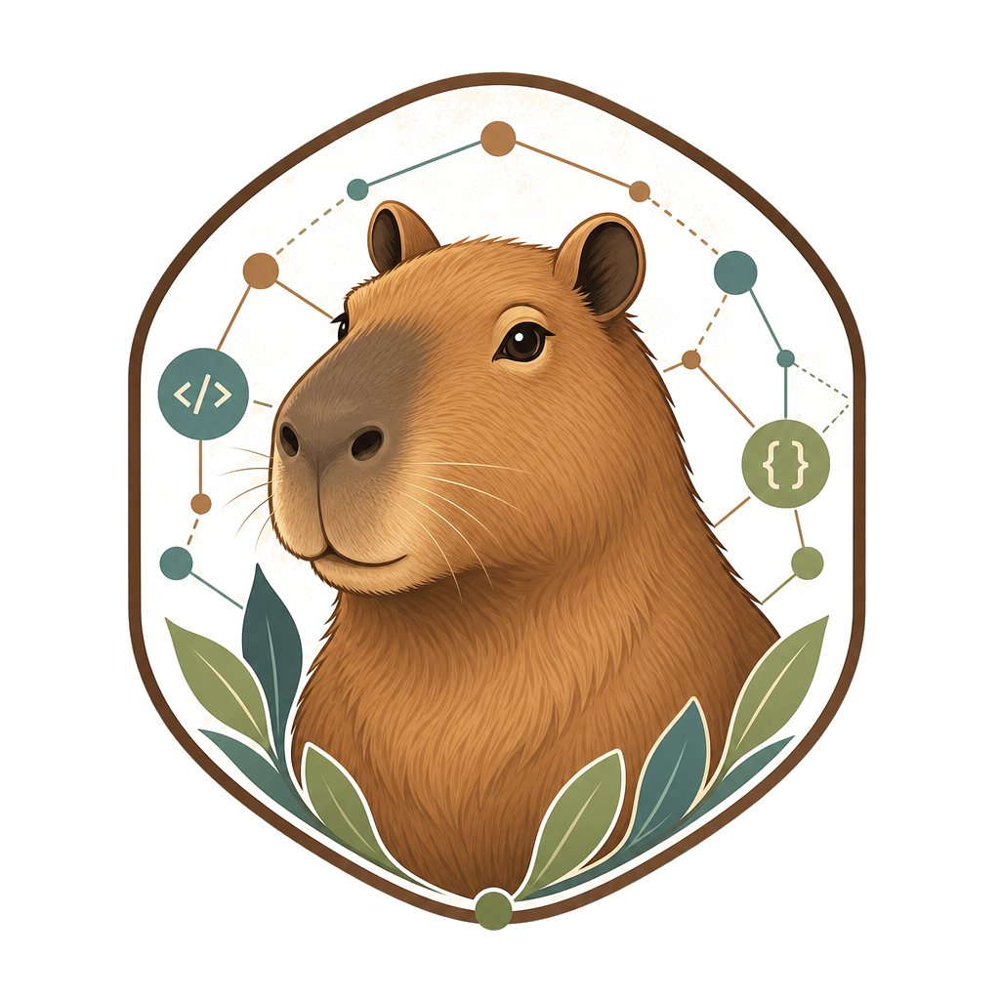

# opencode-capybara

<p align="center">
  
</p>

Standalone OpenCode multi-agent configuration yang tenang, terarah, dan safety-gated untuk coding, docs, UI, browser validation, security scan, GitHub context, dan visual asset workflow.

`opencode-capybara` adalah konfigurasi OpenCode standalone berbasis local Markdown agents, standalone `opencode-*` skills, prompt gates, dan MCP. Fokusnya: koordinasi specialist agents dengan boundary jelas, evidence yang bisa diverifikasi, dan commit policy yang aman.

Repository ini sekarang juga diposisikan sebagai **local harness engineering system**: `AGENTS.md` adalah peta singkat, `.opencode/docs/` adalah knowledge system of record, `.opencode/plans/` menyimpan plan artifact, dan mechanical checks menjaga agar policy tidak drift.

## Kenapa capybara?

Capybara dipilih karena tenang, sosial, adaptif, dan bisa berdampingan dengan banyak spesies—metafora untuk orchestration layer yang menyatukan banyak agent, skill, MCP, dan safety gate tanpa menambah noise.

- **Calm orchestration** — `@orchestrator` meredam chaos multi-agent/multi-tool.
- **Coexistence** — agents, docs, browser, security, GitHub, documents, dan image tooling hidup berdampingan.
- **Social coordination** — multi-agent collaboration bekerja lebih baik dengan role yang jelas.
- **Low drama, high utility** — safety gates dan validation lebih penting daripada aksi agresif.
- **Adaptability** — satu setup bisa berpindah konteks antara code, docs, UI, security, dan document work.

Capybara bukan simbol “cepat sendiri”; ia simbol “tenang bersama-sama sampai hasilnya benar”.

## Quick start

```bash
git clone <REPO_URL> ~/.config/opencode
cd ~/.config/opencode
npm install
npm run setup:tools
npm run doctor
npm run test:prompt-gates
```

Kalau `opencode.json` atau routing model/agent berubah, jalankan:

```bash
npm run post:update
```

Command ini akan me-refresh sinkronisasi OpenChamber lalu menjalankan `doctor`.

Setup environment:

```bash
cp .env.example .env
set -a
source ~/.config/opencode/.env
set +a
opencode
```

Jangan commit `.env`.

## RTK dan Caveman setup

RTK dan Caveman dipasang secara eksplisit, bukan lewat hidden lifecycle hook. Repo ini tidak memakai `postinstall`, `preinstall`, atau `prepare` untuk install tools pihak ketiga, jadi `npm install` tetap aman dan hanya memasang dependency npm project.

Alur yang disarankan:

```bash
npm run setup:tools
npm run doctor
```

- `npm run setup:tools` menyiapkan RTK dan Caveman secara idempotent.
- `npm run setup:tools -- --check` hanya melakukan verifikasi read-only.
- Jika setup otomatis tidak tersedia di platform tertentu, script akan memberi manual fallback command yang jelas.
- RTK binary boleh terpasang, tetapi OpenCode command rewriting tidak auto-enabled; mode itu tetap opt-in dan hanya dipakai kalau user memang meminta.
- Repo ini menerapkan no unsafe lifecycle install hooks policy: tidak ada install tools pihak ketiga tersembunyi di lifecycle hook npm.

Kalau ingin menyiapkan ulang tools dengan paksa, gunakan `npm run setup:tools -- --force`.

## Struktur project

| Path | Fungsi |
|---|---|
| `opencode.json`, `tui.json`, `AGENTS.md` | Core config, MCP, dan global policy |
| `.opencode/docs/` | Canonical system of record untuk routing, quality, evals, security, dan decisions |
| `agents/*.md` | Local Markdown agents untuk primary/subagent routing |
| `skills/opencode-*/SKILL.md` | Workflow contract per specialist |
| `commands/commit-message.md` | Optional read-only helper untuk menyusun commit message manual |
| `commands/init-harness.md`, `commands/init-design.md` | Bootstrap helper untuk `AGENTS.md` harness workflow dan project-local `DESIGN.md` |
| `scripts/prompt-gate-regression.mjs` | Regression gates untuk prompt/config/docs invariants |
| `scripts/*check*.mjs` | Mechanical checks untuk docs, boundaries, skills, dan evidence |
| `bin/image-asset-mcp.mjs` | Local MCP wrapper untuk generated image assets |

## Architecture

- `orchestrator` adalah default primary agent dan router/integrator.
- `artifact-planner` adalah primary agent khusus plan/draft/evidence; bukan implementer.
- Specialist subagents menangani discovery, docs, implementation, UI, architecture review, documents, image assets, consensus, dan final quality review.
- Redundant `build` and `general` local agents have been removed; implementation/testing routes to `@fixer`, and general routing stays with `@orchestrator`.
- Built-in `plan` dan `explore` disabled agar workflow tetap lewat local agents.

## Agent matrix

| Agent | Mode | Fungsi |
|---|---:|---|
| `@orchestrator` | primary | Router/integrator, delegation, validation, final summary |
| `@artifact-planner` | primary | Menulis plan/draft/evidence di `.opencode/` saja |
| `@explorer` | subagent | Local codebase discovery dan reuse mapping |
| `@librarian` | subagent | Official docs/library/API research |
| `@oracle` | subagent | Architecture, simplification, maintainability/risk review |
| `@fixer` | subagent | Bounded implementation, tests, fixtures, Red/Green/Refactor |
| `@designer` | subagent | UI/UX implementation/review dan visual polish |
| `@visual-parity-auditor` | subagent | Read-only screenshot/section parity review |
| `@motion-specialist` | subagent | Read-only animation/reduced-motion review |
| `@accessibility-reviewer` | subagent | Read-only a11y review |
| `@ui-system-architect` | subagent | Read-only tokens/component anatomy review |
| `@visual-asset-generator` | subagent | Image-heavy asset manifest/generation jobs |
| `@document-specialist` | subagent | PDF/spreadsheet/Office/document processing |
| `@product-architect` | subagent | PRD → MVP, epics, user flows, acceptance criteria |
| `@saas-architect` | subagent | Tenancy, workspace/RBAC, billing, usage limits, audit |
| `@ai-systems-architect` | subagent | LLM/RAG/evals, AI safety, cost, reliability boundaries |
| `@security-privacy-reviewer` | subagent | PII, auth, tenant isolation, uploads, payments, AI/biometric data |
| `@release-engineer` | subagent | CI/CD, env, deploy, monitoring, rollback, production readiness |
| `@mobile-architect` | subagent | Native/hybrid/PWA, offline, push, deep links, camera/QR, app-store constraints |
| `@council` | subagent | High-confidence consensus/advisory |
| `@quality-gate` | subagent | Final read-only conformance/risk gate |
| `@skill-improver` | subagent | Bounded prompt/agent/skill refinement |

`@skill-improver` hanya untuk non-trivial follow-up, repeated failures, policy gaps, atau explicit request; no blind external updates. `@quality-gate` status: `PASS`, `PASS_WITH_RISKS`, `NEEDS_FIX`, `BLOCKED`.

Domain specialists bersifat conditional: gunakan untuk PRD/SaaS/AI/security/release/mobile decisions yang material, bukan untuk setiap task. Tiny UI polish tetap ke `@designer` atau direct edit; isolated bugfix tetap ke `@fixer` kecuali ada risk trigger seperti auth, PII, tenant isolation, payment, AI data leakage, atau release risk.

## Workflow singkat

| Work type | Route | Gate |
|---|---|---|
| Unknown codebase | `@explorer` | summarized file/symbol map |
| Library/API docs | `@librarian` | official/current docs |
| Implementation/tests | `@fixer` | Red → Green → Refactor |
| Architecture/risk | `@oracle` | trade-off/risk summary |
| UI/reference | `@designer` + UI specialists | screenshots/evidence when runnable |
| Image-heavy assets | `@designer` manifest → `@visual-asset-generator` | asset metadata + legal notes |
| PRD → production blueprint | `@artifact-planner` + conditional domain specialists | product/SaaS/AI/security/mobile/release readiness |
| SaaS architecture | `@saas-architect` + `@security-privacy-reviewer` as needed | tenancy/RBAC/billing/audit checklist |
| AI feature design | `@ai-systems-architect` + `@librarian`/`@security-privacy-reviewer` as needed | evals, safety, cost, fallback plan |
| Mobile/hybrid architecture | `@mobile-architect` + `@designer`/`@release-engineer` as needed | platform/device validation matrix |
| Production rollout | `@release-engineer` + `@quality-gate` | CI/CD, env, monitoring, rollback evidence |
| Prompt/config/security-sensitive | orchestrator + `@quality-gate` | prompt gates + final quality status |

Domain specialists bersifat conditional; gunakan hanya saat kebutuhan kerja benar-benar memerlukannya. Tiny UI polish tetap ke `@designer`, dan isolated bugfix tetap ke `@fixer`.

## Documentation system of record

- `AGENTS.md` sekarang adalah table of contents + non-negotiable rules.
- Detail policy hidup di `.opencode/docs/`.
- `.opencode/docs/index.md` adalah titik masuk utama untuk architecture, routing, quality, evals, security, skills, decisions, release, dan garbage collection workflow.
- Plans adalah first-class artifacts di `.opencode/plans/`.

## Validation dan auto-commit

```bash
npm run test:prompt-gates
npm run check:harness
```

Prompt gates menjaga standalone identity, local agent boundaries, retired/disabled agents, quality-gate routing, auto-commit safety, anti-AI-slop UI policy, visual asset rules, portability, dan commit-message format.

Harness checks tambahan:

```bash
npm run check:docs
npm run check:agents
npm run check:skills
npm run check:evidence
npm run eval:harness
npm run check:harness:strict
```

`npm run check:harness` menjalankan prompt gates dan mechanical checks secara berurutan.
`npm run eval:harness` menjalankan runnable harness eval fixtures ringan dan menulis replayable report ke `.opencode/evidence/harness-evals/latest/`.
`npm run check:harness:strict` menjalankan `check:harness` lalu `eval:harness` untuk hardening pass yang lebih ketat.

Untuk refresh cepat setelah update config OpenCode:

```bash
npm run post:update
```

Auto-commit default ON untuk local commits only; never push automatically.

- Jalan hanya setelah task plan-bound non-trivial selesai, validation lulus, dan `@quality-gate` memberi `PASS` atau `PASS_WITH_RISKS` tanpa blocker.
- Review `git status`/`git diff`, lalu stage hanya file relevan.
- Commit message otomatis memakai subject singkat plus body bullet-point.
- Jangan stage `.env`, secrets, tokens, credentials, unrelated untracked files, atau generated/vendor files kecuali plan/user menyetujui.
- Jangan gunakan `--no-verify`, `--no-gpg-sign`, `amend`, force push, atau destructive git commands.
- Kalau scope atau staging meragukan, berhenti dan tanya.

## Environment dan MCP

Minimal env dari `.env.example`:

```bash
CLIPROXYAPI_BASE_URL="https://your-openai-compatible-endpoint/v1"
CLIPROXYAPI_API_KEY="your_cliproxyapi_api_key"
BRAVE_API_KEY="your_brave_search_api_key"
CONTEXT7_API_KEY="your_context7_api_key"
GITHUB_PERSONAL_ACCESS_TOKEN="your_github_pat"
GITHUB_TOOLSETS="context,repos,issues,pull_requests,actions,code_security"
STITCH_API_KEY="your_stitch_api_key"
OPENCODE_MODEL_DEFAULT="cliproxyapi/gpt-5.3-codex"
OPENCODE_MODEL_ORCHESTRATOR="cliproxyapi/gpt-5.4"
OPENCODE_MODEL_PLANNER="cliproxyapi/gpt-5.3-codex"
OPENCODE_MODEL_DESIGN="cliproxyapi/gpt-5.4"
OPENCODE_MODEL_REVIEW="cliproxyapi/gpt-5.4"
OPENCODE_MODEL_ADVISORY="cliproxyapi/gpt-5.4"
OPENCODE_MODEL_EXECUTION="cliproxyapi/gpt-5.3-codex"
OPENCODE_MODEL_DISCOVERY="cliproxyapi/gpt-5.4-mini"
OPENCODE_MODEL_DOCUMENTS="cliproxyapi/gpt-5.4-mini"
OPENCODE_MODEL_IMPROVEMENT="cliproxyapi/gpt-5.4-mini"
IMAGE_ASSET_MODEL="gpt-image-2"
```

Copy `.env.example` to `.env` and set every `OPENCODE_MODEL_*` value before launching OpenCode. Missing env vars resolve to an empty string, which can break OpenCode model routing.

### Model routing table

| Env var | Default / recommended model | Used by / capability | Cost guidance |
|---|---|---|---|
| `OPENCODE_MODEL_DEFAULT` | `cliproxyapi/gpt-5.3-codex` | Top-level default model and general fallback | Use Codex lane as balanced default for coding-heavy work while keeping specialist high-risk lanes stronger. |
| `OPENCODE_MODEL_ORCHESTRATOR` | `cliproxyapi/gpt-5.4` | `@orchestrator` primary routing/integration | Keep high quality for delegation, coordination, and final synthesis. |
| `OPENCODE_MODEL_PLANNER` | `cliproxyapi/gpt-5.3-codex` | `@artifact-planner`, `modes/plan.md`, `agents-disabled/plan.md` | Planning is codebase-heavy and can use Codex to reduce cost while keeping structure strong. |
| `OPENCODE_MODEL_DESIGN` | `cliproxyapi/gpt-5.4` | `@designer`, `@visual-parity-auditor`, `@ui-system-architect` | UI and visual reasoning are higher-value, so keep quality high. |
| `OPENCODE_MODEL_REVIEW` | `cliproxyapi/gpt-5.4` | `@oracle`, `@quality-gate`, `@council` | Review lanes should stay strict and high quality; optimize for correctness over cost. |
| `OPENCODE_MODEL_ADVISORY` | `cliproxyapi/gpt-5.4` | `@product-architect`, `@saas-architect`, `@ai-systems-architect`, `@security-privacy-reviewer`, `@release-engineer`, `@mobile-architect` | Advisory work is often high-stakes; keep the stronger model unless cost pressure is extreme. |
| `OPENCODE_MODEL_EXECUTION` | `cliproxyapi/gpt-5.3-codex` | `@fixer` | Use Codex for bounded implementation/testing because this lane is code-edit heavy. |
| `OPENCODE_MODEL_DISCOVERY` | `cliproxyapi/gpt-5.4-mini` | `@explorer`, `@librarian`, `@motion-specialist`, `@accessibility-reviewer` | Discovery and read-only analysis can usually use the lower-cost model. |
| `OPENCODE_MODEL_DOCUMENTS` | `cliproxyapi/gpt-5.4-mini` | `@document-specialist` | Document processing is usually utility work; keep it cost-efficient. |
| `OPENCODE_MODEL_IMPROVEMENT` | `cliproxyapi/gpt-5.4-mini` | `@skill-improver` | Small prompt/skill refinements should stay on the cheaper lane. |

`IMAGE_ASSET_MODEL` tetap terpisah dan saat ini memakai `gpt-image-2`.

MCP yang dikonfigurasi: `time`, `brave-search`, `context7`, `grep_app`, `playwright`, `shadcn`, `stitch`, `semgrep`, `github`, dan `image-asset-generator`.

Cek status:

```bash
set -a
source ~/.config/opencode/.env
set +a
opencode mcp list
```

## TDD dan UI policy

Untuk production behavior: Red → Green → Refactor → Verification. TDD mandatory untuk production logic, bug fix, API/service behavior, UI interaction, validation, dan security-sensitive logic. Docs/prompt/config-only changes cukup dengan validation yang relevan.

Untuk UI/reference work:

1. Route ke `@designer` kecuali tiny non-visual change.
2. Hindari generic UI, blank image frames, random emoji icons, dan placeholder final.
3. Reference work butuh reference/current/final evidence dengan wait → stabilize → scroll → settle → screenshot.
4. Image-heavy work butuh asset manifest dan image generation decision.
5. Generated/provided assets harus punya path relatif, ukuran eksplisit, alt text, dan legal notes.

Untuk build-from-scratch atau substantial UI/UX work, Design Gate harus menjadi general end-to-end UI/UX Design Blueprint sebelum implementasi dianggap siap. Blueprint wajib mencakup experience direction, page-by-page UX blueprint, section-level visual specification, component system plan, visual system, asset and image decision, motion system, interaction/state design, responsive plan, accessibility gate, dan validation evidence. Jika bagian penting hilang, status harus `blocked`, `needs-polish`, atau `draft`, bukan `done`.

Image MCP memakai config-level path portable:

```json
"command": ["node", "{env:HOME}/.config/opencode/bin/image-asset-mcp.mjs"]
```

Untuk asset jobs, `project_root` menunjuk target app/project root dan `target_path` relatif terhadap root tersebut.

## OpenChamber wrapper

Jika OpenChamber tidak mewarisi env shell, buat wrapper:

```bash
mkdir -p ~/.config/opencode/bin
cat > ~/.config/opencode/bin/opencode-with-env <<'EOF'
#!/usr/bin/env bash
set -euo pipefail
ENV_FILE="${OPENCODE_ENV_FILE:-$HOME/.config/opencode/.env}"
if [ -f "$ENV_FILE" ]; then
  set -a
  source "$ENV_FILE"
  set +a
fi
exec opencode "$@"
EOF
chmod +x ~/.config/opencode/bin/opencode-with-env
launchctl setenv OPENCHAMBER_OPENCODE_PATH "$HOME/.config/opencode/bin/opencode-with-env"
```

## Portability, security, troubleshooting

- Jangan hardcode concrete path seperti `/home/<user>` atau `/Users/<user>` di active prompt/config/script.
- Gunakan `$HOME` atau `{env:HOME}` untuk config-level examples.
- Bedakan **OpenCode config root** dari **target app/project root**.
- Jangan paste token ke chat; revoke/regenerate token jika secret pernah ter-commit.
- Batasi GitHub token ke repository/permission yang dibutuhkan.
- Jika MCP gagal, pastikan `.env` sudah diload dan token tersedia.
- Jika agent baru belum terbaca, restart OpenCode lalu jalankan `ping all agents`.

Maintenance minimal sebelum selesai:

```bash
git status --short
npm run test:prompt-gates
npm run check:harness
```

Pastikan validation lulus, `@quality-gate` tidak blocker, staging hanya file relevan, dan tidak push otomatis.
